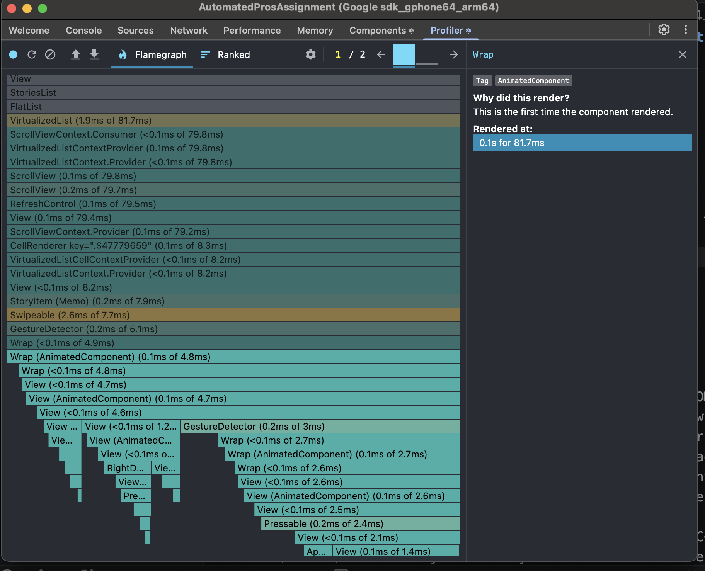
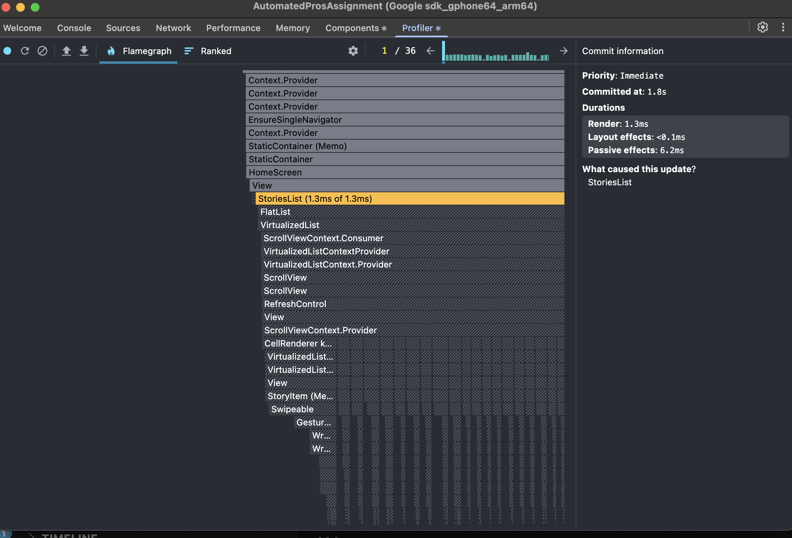

# HackerNews Feed — React Native Technical Assessment

## Overview

This project is a two-screen Hacker News client built with a focus on clear separation between server state and client state, predictable data flow, and performance-conscious UI rendering.

React Query is used for server state (fetching, caching, and background updates), while Zustand manages lightweight client state such as bookmarks, sorting, and UI behavior. The goal was to keep the architecture simple but scalable, avoiding over-engineering while still following production-grade patterns.

---

## 1. Setup & Running the App

### Prerequisites

- Node.js 18+
- React Native CLI: `npm install -g react-native-cli`
- Android Studio (API 30+) or Xcode 14+ (iOS 14+)
- CocoaPods (iOS): `sudo gem install cocoapods`

### Installation

```bash
yarn
cd ios && pod install && cd ..
```

### Environment

Create a `.env` file in the project root:

```
API_BASE_URL=https://hacker-news.firebaseio.com/v0/
```

### Run

```bash
# Android
yarn android

# iOS
yarn ios
```

### Tests

```bash
yarn test
```

---

## 2. Architecture Decisions

### Folder Structure — Feature-based

```
src/
├── screens/          # One folder per screen, self-contained
├── components/       # Shared, single-responsibility UI components
├── hooks/queries/    # All React Query data-fetching hooks
├── store/            # Zustand slices (bookmarks, scroll position)
├── utils/            # Pure, stateless utilities (sorting, filtering, time, URL)
├── theme/            # Design tokens (colors, spacing, radius, typography)
└── navigation/       # Navigator config and typed param lists
```

This keeps business logic out of components and makes each layer independently testable.

### State Management — Zustand

Zustand was chosen over Redux Toolkit for two reasons specific to this project:

- **Minimal boilerplate**: bookmarks and scroll position are simple slices that do not need reducers, action creators, or selectors. Zustand keeps the API minimal and avoids the need for reducers, actions, and boilerplate.
- **Persistence is a first-class plugin** (`zustand/middleware persist`) — wiring AsyncStorage took three lines, vs. the redux-persist configuration overhead.

Redux Toolkit would be the right call on a app with complex server-state synchronisation, optimistic updates, or middleware chains. At this scope, it would be overengineering.

### Server State — React Query (@tanstack/react-query)

React Query is used to manage all server state, including fetching, caching, and background refetching. The top stories are fetched using a single query (`queryKey: ['topStories']`) that internally retrieves the first 20 IDs and resolves them in parallel.

I intentionally used a single query instead of multiple queries (e.g. `useQueries`) to avoid unnecessary re-renders and to keep loading/error states simple and predictable. This also ensures the UI behaves consistently during refresh and navigation.

React Query’s caching allows the list to persist across navigation without refetching, improving perceived performance and reducing network usage.

### Bookmark Persistence — AsyncStorage

AsyncStorage was chosen over MMKV because it is the zero-config default and the data set is tiny (an array of integers). MMKV would be the correct choice if bookmark data grew large or if synchronous reads were needed to avoid a flash on cold start. The trade-off is accepted and documented here.

### Image Loading — react-native-fast-image

FastImage improves image loading performance and caching, especially on Android, priority queueing, and significantly faster image loading on Android compared to the built-in `Image` component. Favicon images are fetched via Google's favicon API so no third-party image CDN registration is required.

### Navigation — React Navigation v6 (Native Stack)

`NativeStackNavigator` was used instead of the JS stack for native-platform transitions and lower overhead. A typed `RootStackParamList` enforces param safety at compile time.

---

## 3. Known Trade-offs

- **`getItemLayout` uses a fixed `ROW_SIZE` constant.** Items with very long titles will wrap and exceed that height, causing scroll restoration to land slightly off. A production fix would measure item heights with `onLayout` and cache them.

- **Scroll position resets on cold restart.** The scroll offset is saved to an in-memory Zustand store. Navigation-back restoration works correctly (as required), but a full cold-start restoration would require persisting the offset to AsyncStorage.

---

## 4. Profiling

### Load the home screen cold



### Scroll up and down through the list



## 4. Technical Questions

### Q1 — Bridge vs JSI & The New Architecture

In the old React Native architecture, JavaScript and native code communicate through something called the Bridge. It works, but it’s not very efficient because everything has to be serialized into JSON and sent asynchronously. That means if you’re passing a lot of data or doing frequent updates (like animations or real-time UI changes), it can become a bottleneck and cause dropped frames or delays.

JSI changes this by removing the Bridge entirely and allowing JavaScript to talk to native code more directly. Instead of serializing everything, it can call native functions and even share memory in some cases. This makes a big difference in performance, especially for things that need to be fast and responsive.

On top of that, the new architecture introduces Fabric and TurboModules. Fabric improves how rendering works and makes it more aligned with modern React features like concurrent rendering. TurboModules make native modules more efficient by loading them only when they’re actually needed, instead of all at once at startup.

### Q2 — Diagnosing a Janky FlatList

The first thing I’d do is confirm where the bottleneck is instead of guessing. I’d turn on the React Native Performance Monitor and use the React DevTools Profiler (or Flipper) to see if the issue is coming from JS thread drops, excessive re-renders, or layout work on the native side. This helps me understand whether the problem is rendering, data handling, or something else like expensive calculations.

Once I have that signal, I’d check if the list is re-rendering more than it should. A common issue is unstable references — for example, inline renderItem functions or missing memoization. I’d wrap list items with React.memo, use useCallback for renderItem, and make sure the keyExtractor is stable so React can properly reuse rows.

Next, I’d look at FlatList-specific optimizations. For a list with a fixed item height, I’d implement getItemLayout to avoid costly layout calculations during scrolling. I’d also tune props like initialNumToRender, windowSize, and maxToRenderPerBatch to reduce how much work is done at once, especially on mid-range devices.

Finally, I’d make sure each list item is as lightweight as possible. That means avoiding heavy computations inside render, precomputing values (like formatted time), and keeping the component tree shallow. If needed, I’d also move expensive logic outside the render path or memoize it. Overall, the goal is to reduce unnecessary work both in rendering and during scrolling.

### Q3 — useCallback and useMemo

A good example where useCallback provides a real benefit is when working with a FlatList. If I pass an inline renderItem or onPress handler, it gets recreated on every render, which can cause all list items to re-render unnecessarily. By wrapping those functions in useCallback, especially when combined with React.memo on the item component, I can prevent avoidable re-renders and keep scrolling smooth. In this case, the improvement is measurable, particularly on lower-end devices or large lists.

For useMemo, a common use case is when doing derived calculations on a dataset, like sorting or filtering articles before rendering. Instead of recalculating on every render, memoizing the result ensures the computation only runs when the dependencies change, which helps when the dataset is large or the logic is non-trivial.

On the other hand, using useMemo everywhere can actually hurt performance. If the computation is cheap (like a simple map or small array operation), the overhead of tracking dependencies and maintaining the memoized value can cost more than just recalculating it. It also adds complexity and makes the code harder to read.

So I usually treat useMemo and useCallback as optimization tools, not defaults — I use them when there’s a clear re-render or computation cost, not preemptively.

### Q4 — State Management Decision

For an app with around 12 screens and some shared global state like auth, theme, and cart, I’d think about how complex the state really is and how often it changes. The Context API is fine for simple cases, but it doesn’t scale well when state updates frequently, because it can trigger unnecessary re-renders and gets hard to manage as the app grows. I’d usually avoid using it as the main state solution in anything beyond small apps.

Between Redux Toolkit and Zustand, both are solid, but they serve slightly different needs. Redux Toolkit is more structured and predictable, which is great for larger teams or more complex flows where you want strict patterns, middleware, and debugging tools. Zustand, on the other hand, is much lighter and faster to work with, with less boilerplate and a simpler mental model.

For this kind of app, I’d likely start with Zustand because it keeps things simple and avoids over-engineering, while still handling global state cleanly. It also works well alongside tools like React Query, where server state is managed separately. However, if the app grows in complexity — for example, more advanced business logic, complex side effects, or a larger team needing stricter conventions — I’d consider moving to Redux Toolkit for better scalability and consistency.

### Q5 — Offline-First UX Strategy

For an offline-first screen, the first step is detecting connectivity. I’d use something like @react-native-community/netinfo to listen to network changes and show a clear UI state (like an offline banner) so the user knows what’s going on. That’s important for setting expectations.

For caching, I’d rely on a combination of React Query for server state and a persistent storage like MMKV or AsyncStorage. React Query can cache the last successful response in memory, and with persistence, I can restore that data even after a cold start. This allows the screen to still show meaningful data when the user is offline.

For cache invalidation, I’d usually define a reasonable stale time and trigger refetches when the app comes back online. I wouldn’t try to aggressively sync everything in the background unless it’s really necessary, since that adds complexity. Instead, I’d prioritize showing cached data quickly and refreshing it when possible.

The main trade-off here is complexity versus reliability. Adding offline support means more edge cases — like stale data, sync conflicts, or partial updates. For many apps, a “cache-first with graceful fallback” approach is enough, rather than a fully offline-synced system. So I’d balance how critical offline functionality is against how much complexity the app can handle.

---

## 5. Testing

### Unit Test — `sortStories`

Covers the core business logic for sorting. Verifies correct ordering for both score and time, and ensures edge cases like empty arrays are handled safely.

### Component Test — `StoryItem`

Uses React Native Testing Library to verify rendering and interaction. Asserts that the title and domain are displayed correctly and that pressing the item triggers navigation with the expected params.

The goal of these tests is to cover both pure logic and user interaction, rather than focusing on implementation details.

---

## 7. What I’d Improve with More Time

- Add pagination or infinite scroll instead of limiting to 20 items
- Persist React Query cache to storage for better offline support
- Improve scroll position restoration across cold starts
- Introduce better skeleton loading instead of a simple spinner

I focused on keeping the implementation clean and predictable rather than adding more features with partial quality.

---

## 6. Bonus Features Implemented

- **Bookmarks** — `BookmarksScreen` Bookmarks are stored as a list of IDs in Zustand and mapped against the cached stories from React Query. This avoids duplicating server data while still allowing quick access to bookmarked items.
  A trade-off here is that bookmarked items depend on the availability of cached data. In a production app, I would consider persisting full item data or fetching missing items on demand.
  Swipe-to-remove is implemented via `ReanimatedSwipeable` from `react-native-gesture-handler`.

- **Debounced search** — `AppSearchInput` maintains local state and fires the parent callback after a configurable debounce (default 300 ms). No additional API calls are made; filtering runs client-side over the cached result.
- **Offline banner** — `OfflineBanner` subscribes to NetInfo and renders a red banner when `isConnected` is false. It self-manages connectivity state internally so the parent only needs to pass `isVisible`.
